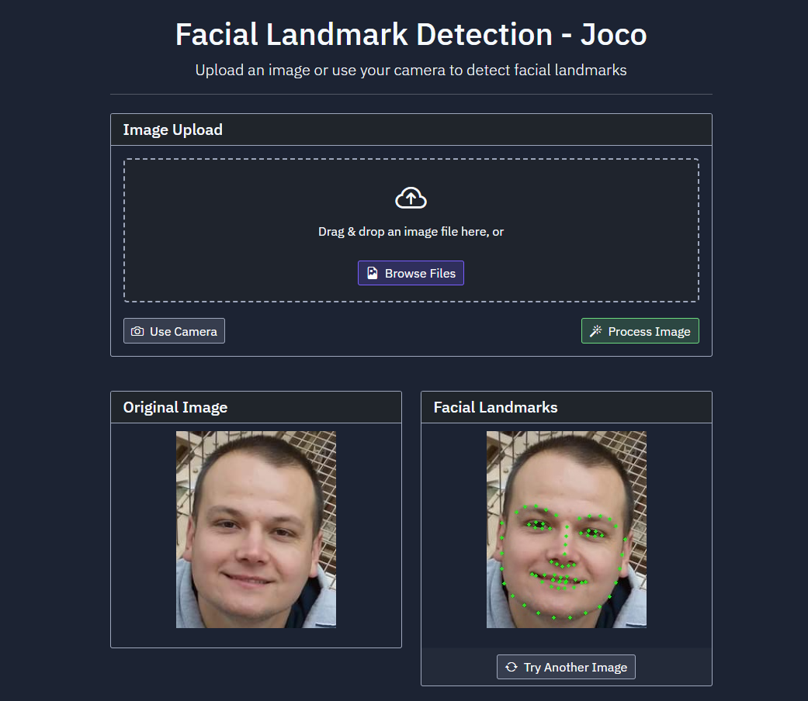

# Facial Landmark Detection Application



A web-based application that detects and visualizes facial landmarks in images using dlib and OpenCV. The application provides a user-friendly interface for uploading images or capturing photos through a webcam to detect facial landmarks.

## Features

- Upload images for facial landmark detection
- Real-time webcam capture and processing
- Detection of 68 facial landmarks
- Interactive user interface with dark theme
- Responsive design for various screen sizes
- Real-time processing status updates
- Support for multiple image formats

## Technologies Used

- **Backend:**
  - FastAPI (Python web framework)
  - dlib (Facial landmark detection)
  - OpenCV (Image processing)
  - NumPy (Numerical computations)
  - Uvicorn (ASGI server)

- **Frontend:**
  - HTML5
  - CSS3
  - JavaScript
  - Bootstrap 5
  - Bootstrap Icons

## Prerequisites

- Python 3.11 or higher
- Modern web browser with camera access (for webcam feature)

## Installation

1. Clone the repository:
   ```bash
   git clone [repository-url]
   cd FaceLandmarkTracker
   ```

2. Install the required dependencies:
   ```bash
   pip install -r requirements.txt
   ```

3. The application will automatically download the required dlib facial landmark predictor model on first run.

## Running the Application

1. Start the application:
   ```bash
   python main.py
   ```

2. Open your web browser and navigate to:
   ```
   http://localhost:5000
   ```

## Usage

1. **Upload an Image:**
   - Click "Browse Files" or drag and drop an image
   - Click "Process Image" to detect facial landmarks

2. **Use Webcam:**
   - Click "Use Camera" to access your webcam
   - Click "Capture Photo" to take a picture
   - The captured image will be automatically processed

3. **View Results:**
   - The original image and processed image with facial landmarks will be displayed side by side
   - Green dots indicate detected facial landmarks
   - Click "Try Another Image" to start over

## API Endpoints

- `GET /`: Main application interface
- `POST /process-image/`: Process uploaded images
- `GET /health`: Health check endpoint

## License

[Add your license information here]

## Contributing

Contributions are welcome! Please feel free to submit a Pull Request.

## Acknowledgments

- dlib library for facial landmark detection
- OpenCV for image processing capabilities
- FastAPI for the web framework 